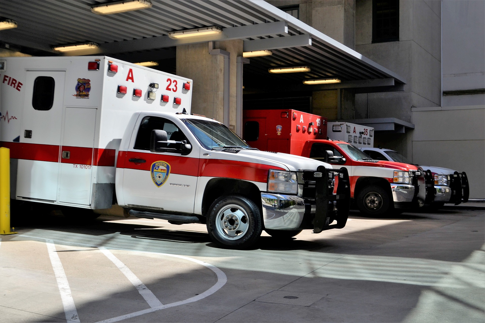

# Emergency Vehicle Detection Using Convolutional Neural Networks

Image by <a href="https://pixabay.com/users/artisticoperations-4161274/?utm_source=link-attribution&amp;utm_medium=referral&amp;utm_campaign=image&amp;utm_content=3323451">F. Muhammad</a> from <a href="https://pixabay.com//?utm_source=link-attribution&amp;utm_medium=referral&amp;utm_campaign=image&amp;utm_content=3323451">Pixabay</a>

> This project follows the steps and methodology of predicting CO2 emissions. The features used in training the model were derived from the fuel consumption ratings data from 2010 to 2014 in Canada. Additionally, the report also explores the features that best classify the vehicles in the data set. 

---

### Table of Contents

- [Description](#description)
- [Key Considerations](#key-considerations)
- [References](#references)
- [License](#license)
- [Author Info](#author-info)

---

## Description
It is a common driving regulation to pull to the side of the road to allow emergency vehicles such as a medical ambulance, or fire brigade vehicle, to go through. Therefore, every driver on the road needs to be able to detect and cautiously steer clear of such emergency vehicles while still adhering to all traffic signs. This ability to detect emergency vehicles is necessary for preventing collisions. This model can be applied towards traffic systems to be able to differentiate between emergency and non-emergency vehicles

---

## Key Considerations
Data pre-processing and preparation: For this task, data pre-processing entailed the definition of all images to the network. This involved setting the path to where test and training images are located on the machine.

Data augmentation: This is done to make the model robust in classifying images it has not encountered before and also prevents overfitting to the training data. This involves the use of the Keras ImageGenerator module to perform transformations on the images.

Kernel size: Based on the kind of classification task, the images to be differentiated are made up of generalized features, for example, the basic colour composition of emergency vehicles. 

The number of filters: This specifies the number of feature maps to be used. The higher the number of filters, the higher the likelihood of the model discovering and learning more image features that are present anywhere in an image (Brownlee, 2019). The smallest number of filters is usually used at the input layer and then increases by a power of two as more layers are added.

Strides: This hyperparameter defines the step size that the filter will move along the image. In this task, a stride of 1 is used to ensure full image coverage.

Padding: This is the number of pixels that will be added to the image while the kernel is processing it (DeepAI, n.d.). For this task, ‘same’ because it is optimal for model performance that the input image is fully covered by the filter.

Activation functions: These functions transform the output of a neural network to fit results and improve accuracy. The activation function used at the first layers of the model was the ReLu function, and at the dense layer, sigmoid was used because it is a binary classification task.

#### Technologies

- Python
- Jupyter Notebook
- Excel
- Matplotlib
- Seaborn
- Scikit-learn
- Tensorflow

[Back To The Top](#emergency-vehicle-detection-using-convolutional-neural-networks)

---

## References

- LinkedIn - [Mary-Ann Egbudom](https://www.linkedin.com/in/mary-ann-egbudom-9017b3109)
- Twitter - [@Rianne_egb](https://twitter.com/Rianne_egb)

[Back To The Top](#emergency-vehicle-detection-using-convolutional-neural-networks)

---

## License

MIT License

Copyright (c) [2022] [Mary-Ann Egbudom]

Permission is hereby granted, free of charge, to any person obtaining a copy
of this software and associated documentation files (the "Software"), to deal
in the Software without restriction, including without limitation the rights
to use, copy, modify, merge, publish, distribute, sublicense, and/or sell
copies of the Software, and to permit persons to whom the Software is
furnished to do so, subject to the following conditions:

The above copyright notice and this permission notice shall be included in all
copies or substantial portions of the Software.

THE SOFTWARE IS PROVIDED "AS IS", WITHOUT WARRANTY OF ANY KIND, EXPRESS OR
IMPLIED, INCLUDING BUT NOT LIMITED TO THE WARRANTIES OF MERCHANTABILITY,
FITNESS FOR A PARTICULAR PURPOSE AND NONINFRINGEMENT. IN NO EVENT SHALL THE
AUTHORS OR COPYRIGHT HOLDERS BE LIABLE FOR ANY CLAIM, DAMAGES OR OTHER
LIABILITY, WHETHER IN AN ACTION OF CONTRACT, TORT OR OTHERWISE, ARISING FROM,
OUT OF OR IN CONNECTION WITH THE SOFTWARE OR THE USE OR OTHER DEALINGS IN THE
SOFTWARE.

[Back To The Top](#emergency-vehicle-detection-using-convolutional-neural-networks)

---

## Author Info

- LinkedIn - [Mary-Ann Egbudom](https://www.linkedin.com/in/mary-ann-egbudom-9017b3109)
- Twitter - [@Rianne_egb](https://twitter.com/Rianne_egb)

[Back To The Top](#emergency-vehicle-detection-using-convolutional-neural-networks)
